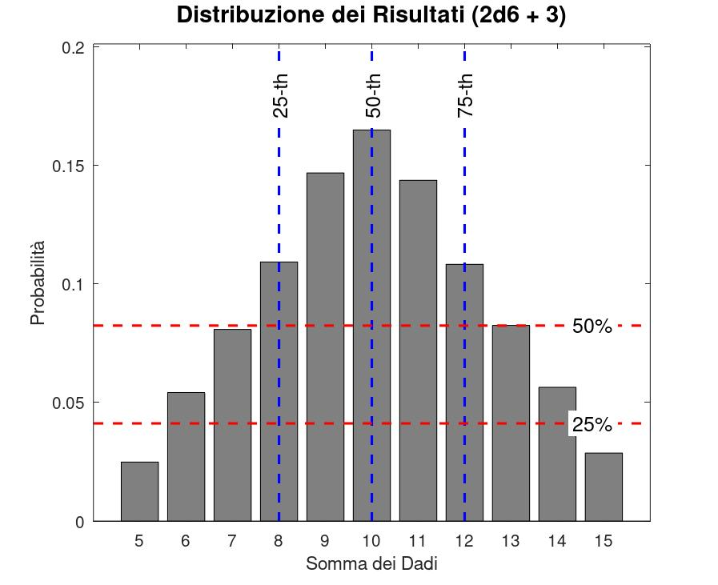
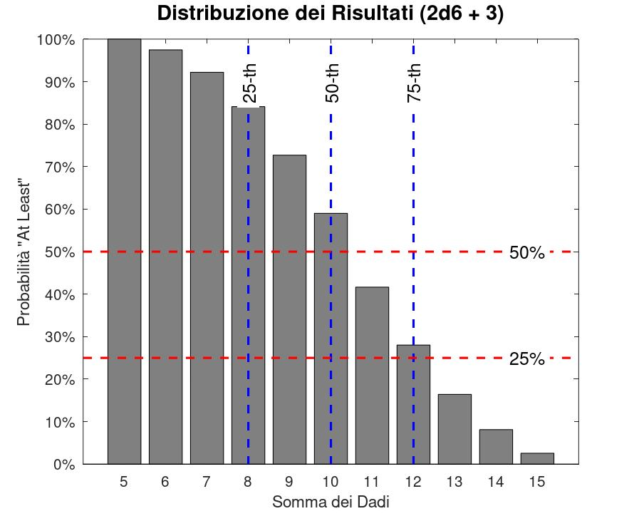
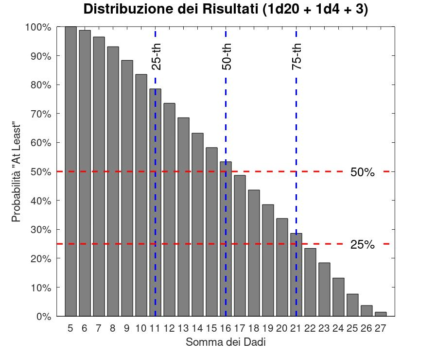
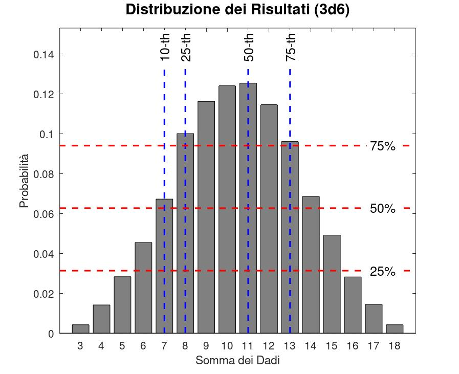
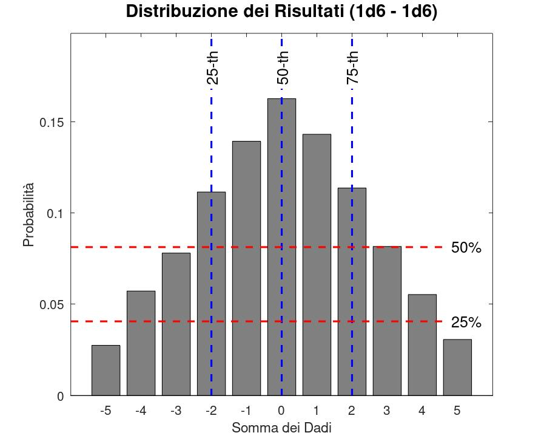

# Dice Roll Simulation in MATLAB/OCTAVE

**A poor man version of anydice in MATLAB/OCTAVE for dice rolling probabilities.**

The `poorly_dice` function simulates dice rolls and calculates various statistics related to the dice roll distribution. It is designed to accept input in specific formats and generate representative graphs depicting the distribution.

## Function

```matlab
poorly_dice(dice_inputs, plot_type, num_rolls, percentile, probability)
```

### Input

- **dice_inputs**: a cell array of strings representing the dice to roll or constants. Each string can be in the format:
  - `+/-XdY`: where `X` is the number of dice and `Y` is the number of faces on the die (e.g., `2d6` for two six-sided dice). The sign +/- indicate if the dice rolls are added or subtracted (e.g., {`2d6` `-1d8`} for 2d6 + -1d8, the positive sign ca be omitted).
  - `+/-X`: to add/subtract a constant to the results.
  
- **plot_type**: a string that specifies the type of graph to generate. The options are:
  - `'normal'`: to display the normal distribution of results.
  - `'at least'`: to show the cumulative probability of getting at least a certain score.
  - `'at most'`: to show the cumulative probability of getting at most a certain score.
  
- **num_rolls**: an integer indicating the total number of rolls to perform.

- **percentile**: a vector of percentiles to plot as vertical lines in the graph (e.g., `[25, 50, 75 ...]` for the 20-th 50-th and 75-th percentiles).

- **probability**: a vector of probabilities to plot as horizontal lines in the graph (e.g., `[0.1, 0.2, 0.5, 0.75 ...]`) for the 10%, 20%, 50% or 75%.

### Output
The function returns two outputs:

- **edges**: an array representing the edges of the histogram (classes).
  
- **probability**: an array representing the probabilities associated with each interval defined by the **edges**.

### Graphs

The function produces graphs representing the distribution of dice roll results. Depending on the specified `plot_type`, the graph may show:

- **Normal Distribution**: A histogram representing the distribution of results, with axes showing the obtained values and frequency.
  
- **Cumulative Probability**: Vertical lines indicating percentiles and horizontal lines representing the probabilities provided as input. 

The graphs will also include summary statistics such as mean, median, standard deviation, maximum, and minimum values.

### Example Usage

```matlab
poorly_dice({'2d6', '+3'}, 'normal', 10000, [25, 50, 75], [1/4, 1/2]);
```

In this example, the function simulates the rolling of two six-sided dice, adds 3 to the results, and generates a graph of the normal distribution of the results.



```matlab
poorly_dice({'2d6', '+3'}, 'at least', 10000, [25, 50, 75], [1/4, 1/2]);
```

In this example, the function simulates the rolling of two six-sided dice, adds 3 to the results, and generates a graph of the "at least" distribution of the results.



```matlab
poorly_dice({'1d20', '1d4', '+3'}, 'at least', 10000, [25, 50, 75], [1/4, 1/2]);
```

In this example, the function simulates the rolling of 1 twenty-sided dice, adds 1 four-sided dice and add 3 to the results, and generates a graph of the "at least" distribution of the results.



Other examples:





